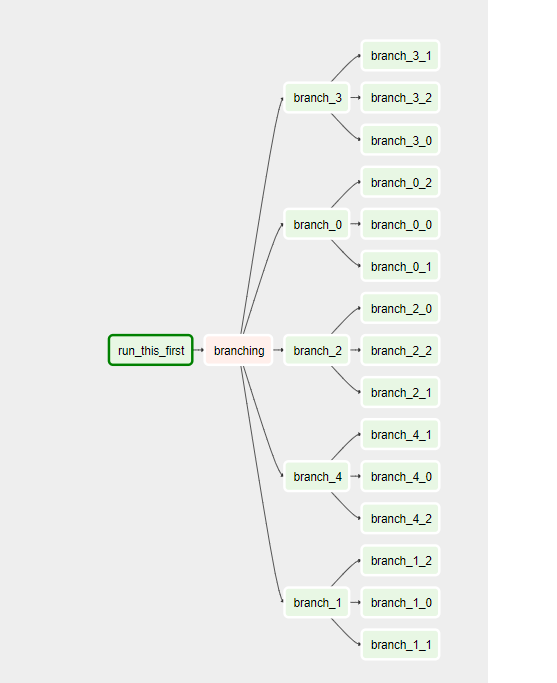

the below code will work based on the output received from the python method

from airflow.operators.python_operator import BranchPythonOperator
from airflow.operators.dummy_operator import DummyOperator
from datetime import datetime, timedelta
from airflow.models import DAG
import random


args = {
    'owner': 'airflow',
    'depends_on_past': False,
    'start_date': datetime(2018, 5, 26),
    'email_on_failure': False,
    'email_on_retry': False,
    'retries': 1,
    'retry_delay': timedelta(minutes=5),
}

dag = DAG(
    dag_id='BranchDag',
    default_args=args,
    schedule_interval="* */1 * * *",
    dagrun_timeout=timedelta(minutes=1))


```
def return_branch(**kwargs):

    branches = ['branch_0','branch_1', 'branch_2', 'branch_3', 'branch_4']
    print(random.choice(branches))
    return random.choice(branches)

with dag:
    firstdag = DummyOperator(task_id='run_this_first')

    branching = BranchPythonOperator(
        task_id='branching',
        python_callable=return_branch,
        provide_context=True)

        firstdag >> branching

    for i in range(0, 5):
        d = DummyOperator(task_id='branch_{0}'.format(i))
        for j in range(0, 3):
            m = DummyOperator(task_id='branch_{0}_{1}'.format(i, j))

            d >> m

        branching >> d
        
 ```
 
 

