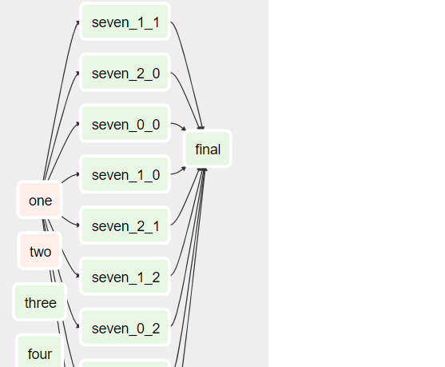

create dynamic tasks in airflow

To create dynamic parallel tasks:

```for x in range(3):
    for y in range(3):
        seven=DummyOperator(task_id='seven_'+str(x)+'_'+str(y), dag=dag)

        one >> seven >> final
        
```        



