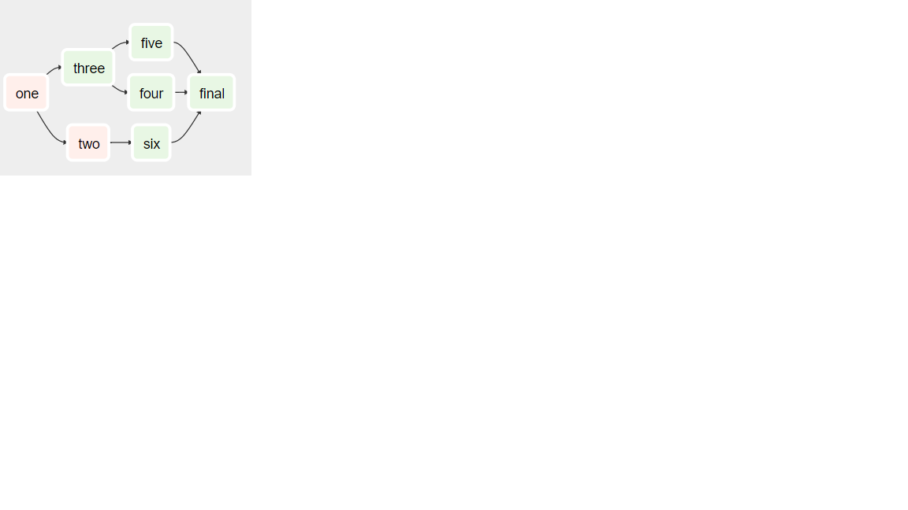
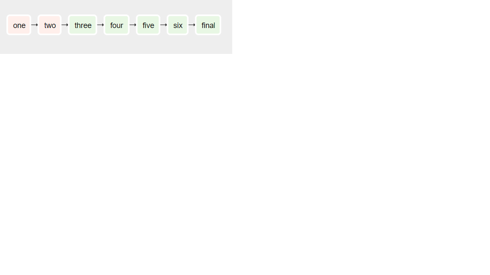

Code:

```import os
from airflow.operators import BashOperator
from airflow.models import DAG
from airflow.operators import PythonOperator, DummyOperator
from datetime import datetime, timedelta

args = {
    'owner': 'airflow',
    'depends_on_past': False,
    'start_date': datetime(2016, 3, 29, 8, 15),
}

dag = DAG(
    dag_id='notice_slack2',
    default_args=args,
    schedule_interval="* */1 * * *",
    dagrun_timeout=timedelta(minutes=1))


def test():
    print('hi shamim')

def testone():
    print('hi shamim one')

one = PythonOperator(
            task_id='one',
            python_callable=testone,
            dag=dag
        )
two = PythonOperator(
    task_id='two',
    python_callable=test,
    dag=dag,
    )
three = DummyOperator(task_id='three', dag=dag)
four = DummyOperator(task_id='four', dag=dag)
five = DummyOperator(task_id='five', dag=dag)
six = DummyOperator(task_id='six', dag=dag)
final = DummyOperator(task_id='final', dag=dag)

```
1. sequential tasks:

2. 

one >> [two , three]

three >> [four,five]

two >> six
six >> final
[four,five] >> final



